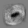
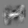
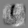

# MNIST example with image output

The beginner tutorial didn't have an example of generating a image to visualize data. This example shows a basic usage of `tf.image_summary` along with steps to reshape one tensor to your desired shape.

## Prerequisite
* Complete tensorflow [setup](https://www.tensorflow.org/versions/master/get_started/os_setup.html).
* Install [input_data.py](https://tensorflow.googlesource.com/tensorflow/+/master/tensorflow/examples/tutorials/mnist/input_data.py) from the tensorflow mnist tutorial.

## Running the code
```
python mnist.py
tensorboard --logdir=/tmp/mnist_logs
```
Then open `localhost:6006` in your browser and open the IMAGES tab.

## Output



